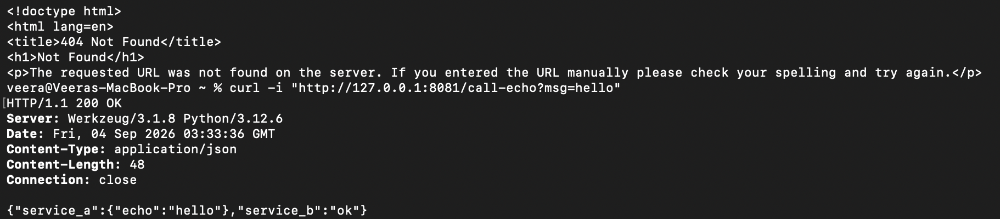
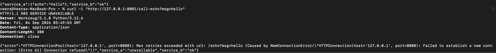
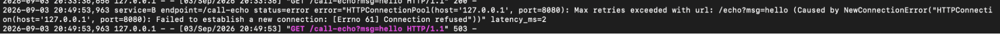
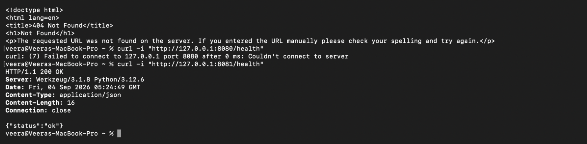

# CMPE 273 – Week 1 Lab 1: Your First Distributed System

Two small HTTP services that run as separate processes and talk to each other over the network. I used the **Python track** (Flask + requests).

- **Service A** — echo API, listens on `127.0.0.1:8080`
- **Service B** — client, listens on `127.0.0.1:8081`, and calls Service A to do its job

|Service|Endpoint|What it does|
|---|---|---|
|A|`GET /health`|returns `{"status":"ok"}`|
|A|`GET /echo?msg=hello`|returns `{"echo":"hello"}`|
|B|`GET /health`|returns `{"status":"ok"}`|
|B|`GET /call-echo?msg=hello`|calls A's `/echo` and returns a combined response|

---

## How to Run Locally

You need **three terminals**: one for each service, and one to send requests. Both services block the terminal they run in, so they each need their own.

### Terminal 1 — Service A

```bash
cd python-http/service-a
python3 -m venv .venv
source .venv/bin/activate
pip install -r requirements.txt
python app.py
```

Wait for `Running on http://127.0.0.1:8080`, then leave this terminal alone.

### Terminal 2 — Service B

```bash
cd python-http/service-b
python3 -m venv .venv
source .venv/bin/activate
pip install -r requirements.txt
python app.py
```

Wait for `Running on http://127.0.0.1:8081`, then leave this one alone too.

### Terminal 3 — sending requests

```bash
curl -i "http://127.0.0.1:8081/call-echo?msg=hello"
```

Windows users: use `.venv\Scripts\activate` instead of the `source` line.

---

## Success Proof

Both services running. Service B receives the request, calls Service A, and returns the combined result.



Log lines from Service B (Terminal 2):

The round trip took 19ms — that includes B's own handling plus the full network call out to A and back.

---

## Failure Proof — Independent Failure

I stopped Service A with `Ctrl+C` in Terminal 1 and left Service B running, then sent the exact same request again.

### Service B degrades instead of crashing

Service B's error log:

### Service B is still healthy on its own

With Service A still down:

This is the part that shows the failure is contained. Service A is gone, but Service B is alive, answering requests, and reporting a clear 503 for the one operation that actually depends on A.

### A note on the latency numbers

The failed call came back in **2ms**, faster than the 19ms success. That surprised me at first, but it makes sense: nothing was listening on port 8080, so the operating system refused the TCP connection immediately. There was nothing to wait for.

That's a _connection error_, not a timeout — two different failure modes that happen to produce the same 503 here. If Service A had still been running but responding slowly, Service B's one-second timeout would have fired instead and the latency would read around `1001ms`.

---

## What Makes This Distributed?

Service A and Service B run as two separate processes with separate memory and lifecycles. They communicate only through HTTP requests over a network connection, even though both run on the same computer. When Service A stopped, Service B still worked for its own `/health` endpoint and returned a clear 503 only for the request that needed A. This shows that a remote service can fail independently, and B only discovers the failure when it tries to contact A. Service B needs a timeout so it does not wait forever for a slow or unavailable Service A. Otherwise, too many waiting requests could make Service B unavailable too.

---

## Repo

`https://github.com/<your-username>/cmpe273-week1-lab1-starter`
